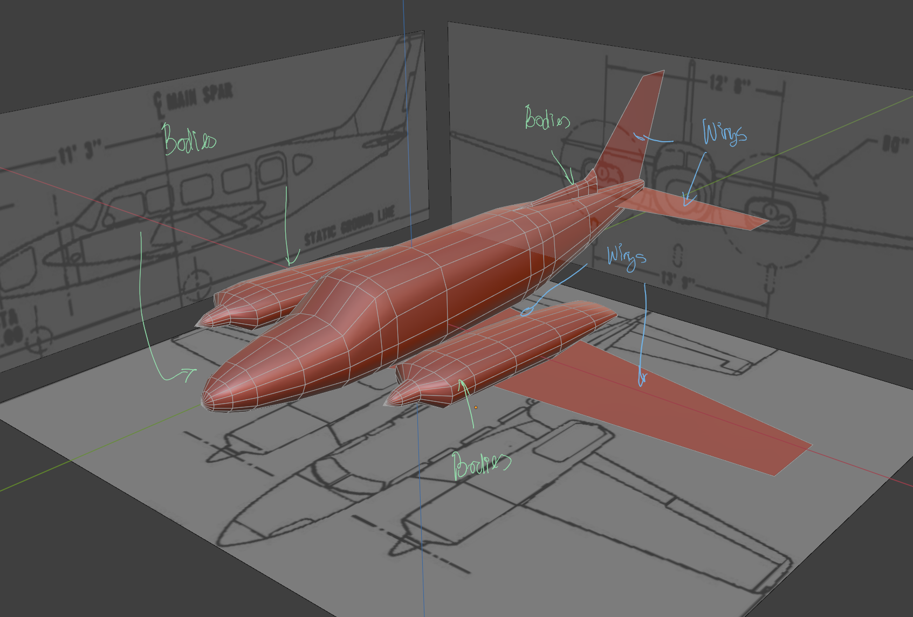
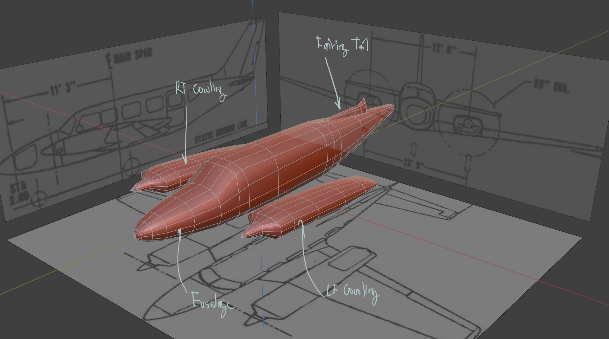
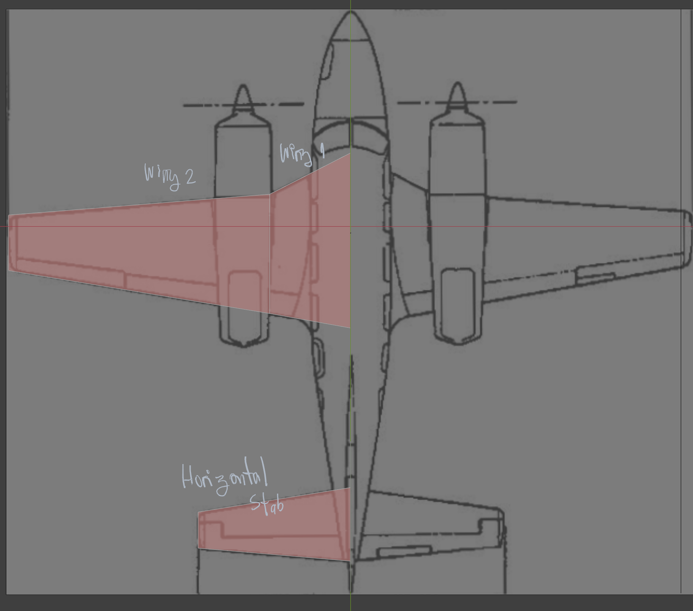
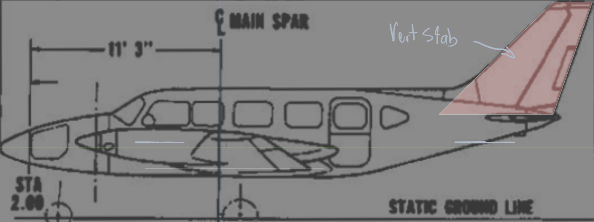
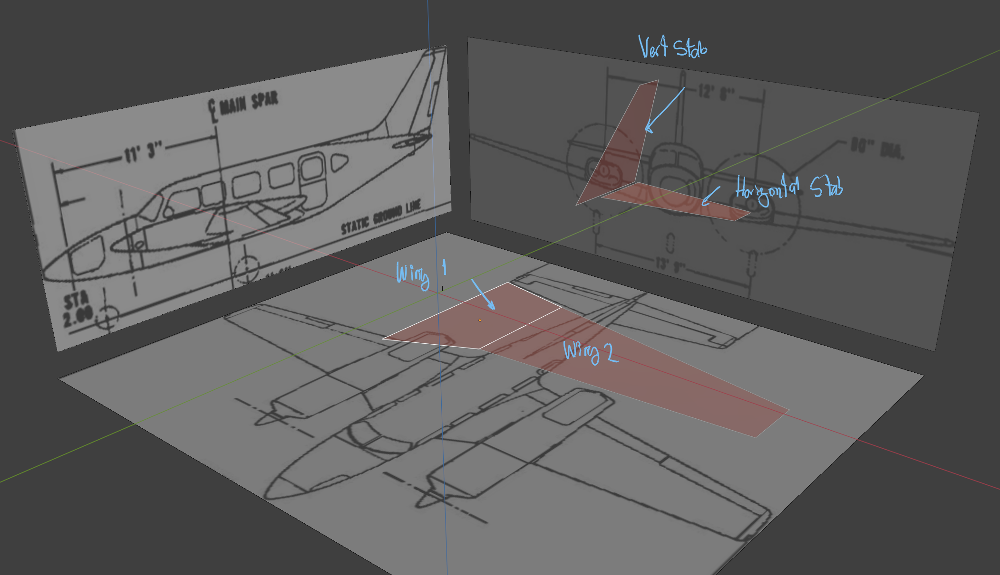
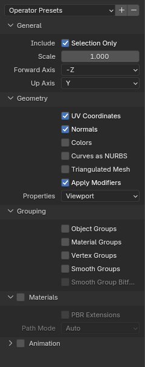

# Blender Guidelines to create the 3d flight model.

There are two main object categories.

Bodies and Wings.

### 1 - Bodies

Fuselage, cowling, fairings, etc are considered bodies for PM.  Name your bodies correctly
Fuselage,  LF_Cowling, RT_Cowling, Faring_tail, Fairing_wings, etc.
- Every body needs to have the following charateristics:
- 1 vertex at the nose/tip and 1 vertex at the end.
- The inner rings between the nose and tail should have between 8 and 16 vertices.

### 2 - Wings

Wings, horizontal and vertical stab are considered wings.
- Wings are built from single planes.  Each wing should have only 4 vertices, depicting the x section of the each one of the wings.
- Naming is important.  The main wing should be named Wing1, the wing when it changes geometry as the illustration shows, should be named Wing2.
- Horizontal Stabilator, should be named horizontal_stab.
- Vertical Stabilator, should be named vert_stab.

The app will caculate the wing parameters for Plane Maker from this planes.

Look at the top and side views for reference.    

Orthographic view for the wings elements.

### 3 - Exporting

Once you are done with the modeling of the bodies and the wings reference planes, select all your objects and export them as an .obj wavefront format file.

Use the following setting to export your .obj file

