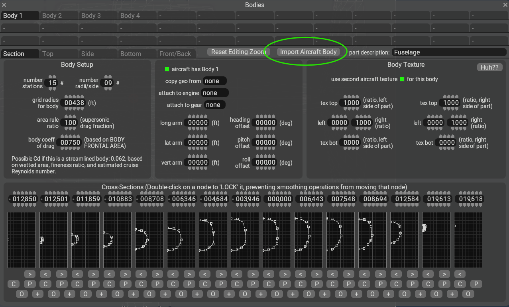

# **OBJ2PM Bodies Engine — User Guide**

## **OBJ2PM Bodies Engine – Description**

OBJ2PM is a specialized tool that takes clean, topology-friendly 3D meshes exported from Blender and automatically rebuilds the entire Plane-Maker bodies block inside an X-Plane .acf file.

It extracts fuselages, cowlings, fairings, or any aircraft body meshes, analyzes their topology using a Blender-accurate ring selection algorithm, and generates perfectly structured _body/n definitions including stations, j-rings, radii, offsets, and geometry coordinates.

The tool ensures that:

All bodies match X-Plane’s internal geometry rules

Station and ring ordering exactly follows Plane-Maker’s format

Partial rings are mirrored and padded correctly

Mesh offsets and radii are auto-calculated

The rebuilt .acf preserves all original aircraft systems

Using a simple GUI, the user selects an .acf, an exported .obj, assigns each mesh to a body index and name, and the tool produces a new .acf with completely rebuilt, fully accurate PM bodies — while keeping everything else untouched.

## **1. Aircraft Orientation in Blender**

For OBJ2PM to correctly detect the nose→tail direction through topology (BFS), your aircraft must follow this coordinate orientation:

- **Nose points toward –Y**
- **Tail points toward +Y**
- X = lateral axis (left/right)
- Z = vertical axis

### **Example Orientation**


---

## **2. Mesh Geometry Requirements**

To reconstruct bodies correctly:

- ✔ Exactly **one nose vertex**  
- ✔ Exactly **one tail vertex**  
- ✔ Mid rings must have **8–16 vertices**  
- ✔ Mesh must be **continuous and watertight**  
- ✔ Up to ~20 BFS stations  
- ✔ Mesh may be offset laterally in X (auto-handled)

---

## **3. Object Naming & Blender Export Settings**

### **Object Naming in Blender**
Give meaningful names such as:
- `Fuselage`
- `LF_cowling`
- `RT_cowling`
- `TailFairing`

These names appear in the GUI.

### **Blender OBJ Export Settings (Critical)**

Use these exact settings when exporting:


Required:
- ☑ **Selection Only**
- Forward Axis: **–Z**
- Up Axis: **Y**
- Geometry → Normals: **ON**
- Geometry → Apply Modifiers: **ON**
- **Do NOT triangulate**  
- **Do NOT export vertex/material groups**

---

## **4. OBJ2PM GUI — Mesh Assignment & File Naming**

When the GUI is opened:

### ✔ **Select the base .acf**
OBJ2PM will only rebuild the `P _body` blocks.

### ✔ **Select the .obj**
This contains fuselage, cowlings, fairings, etc.

### ✔ **New .acf filename**
Automatically suggested:

```
<original>_bodies.acf
```

You may rename it.

### ✔ **Mesh mapping**
The GUI displays a table:

```
Mesh Name        | Body Index | PM Body Name (_descrip)
--------------------------------------------------------
Fuselage         |     0      | Fuselage
LF_cowling       |     1      | Left Cowling
RT_cowling       |     2      | Right Cowling
TailFairing      |     3      | Tail Fairing
...
```

Rules:
- Body indices must be **continuous**: `0,1,2,3,...`
- `PM Body Name _descrip` is the name of the body that appears inside Plane‑Maker

---

## **5. Recommended Workflow**

### **5.1 Start from a Base .acf**
OBJ2PM will **only replace the bodies block**, preserving:
- Control surfaces  
- Engines  
- Systems  
- Airfoils  
- Cockpit  
- Everything except bodies  

### **5.2 Export Meshes From Blender**
Use the recommended export settings.

### **5.3 Build PM Bodies**
Steps:
1. Select `.acf`
2. Select `.obj`
3. Click **Scan OBJ Meshes**
4. Confirm body indices & names
5. Click **Run**

Output example:

```
MyAircraft_bodies.acf
```

### **5.4 GUI Log Messages**

You will see messages such as:

```
[INFO] Found 4 mesh groups in OBJ.
[INFO] Processing fuselage...
[WARN] FairingTail: half-ring has only 5 vertices, filling j slots.
[OK] Wrote new bodies into CIS_Chieftain_bodies.acf.
```

If a mesh is invalid, it is skipped and processing continues.

---

### **5.5 In Plane Maker**

There are two ways to use the new generated .acf file:

1. You can open the new generated .acf file directly in Plane Maker
2. You can import the bodies from the new generated .acf file into your current Plane Maker session using the "Import Aircraft Body" inside the Body # tab you are currently working.   This will import the corresponding body from your new generated .acf file.




# **You are ready to use OBJ2PM to rebuild PM bodies automatically.**

