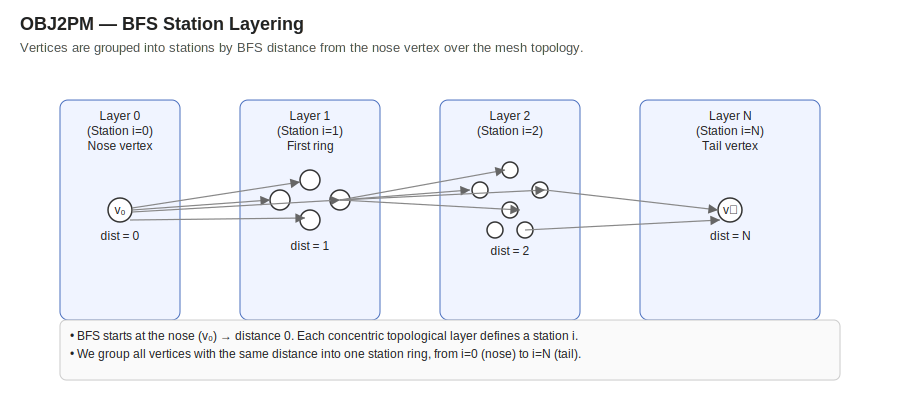

# **OBJ2PM Bodies Engine — Milestone Summary**
### *Topology-Driven Body Reconstruction for X-Plane Plane-Maker*

---

## **Introduction**
The **OBJ2PM Bodies Engine** is a robust, Blender-consistent system for converting OBJ meshes into fully functional **Plane-Maker body blocks**.

It replaces unreliable z-sorting techniques with a smart **topology-based ring selection** — the same method Blender uses for edge-loop selection — ensuring accurate, stable geometry reconstruction for:

- Fuselages  
- Engine cowlings  
- Tail fairings  
- Any symmetrical aircraft body mesh  

---

# **📌 Diagrams**

## **BFS Layering Structure**


## **Full OBJ → PM Data Flow**


*(Ensure the SVG files are stored next to this markdown or adjust the paths accordingly.)*

---

## **1. Mesh Requirements**
1. One vertex at the nose  
2. One vertex at the tail  
3. Mid rings have 8–16 verts  
4. Continuous topology  
5. Mesh may be offset in X  
6. ≤ 20 topology stations  

---

## **2. Station Detection (Topology-Based)**
Stations are identified using **graph-based BFS traversal**:

- Build adjacency from faces  
- BFS from the nose  
- Each BFS layer = one station  
- Tail = last reachable layer  

Matches Blender’s edge-ring selection perfectly.

---

## **3. PM Ring Construction**
Each station ring follows Plane-Maker’s j=0..17 standard:

- Use half-ring X ≥ 0  
- Sort vertices by atan2(y, x)  
- j=0 = top centerline  
- j=8 = bottom centerline  
- j=1..7 right side  
- Mirror to j=9..17  
- Pad missing entries with bottom centerline  

---

## **4. Plane-Maker Parameters**
Automatically computed:

```
_part_x   = mesh lateral centroid
_part_rad = max(|x|,|y|) + 1 ft buffer
_r_dim    = 2 * half_n_max
_s_dim    = number of stations
```

---

## **5. PM Output Ordering**
Exact Plane-Maker internal ordering:

**Stations (i):**  
0, 1, 10..19, 2..9  

**Ring indices (j):**  
0, 1, 10..17, 2..9  

---

## **6. Template-Based Full Block Build**
The system:

- Loads a canonical zeroed PM template  
- Inserts all parameters  
- Inserts all `_geo_xyz` values  
- Output block is **1:1 identical** to PM’s structure  

---

## **7. Pipeline Overview**
OBJ → adjacency → BFS → stations  
→ rings → mirrored + padded  
→ compute parameters  
→ fill PM template  
→ inject into `.acf`

---

## **8. Validation**
Tested on:

- Fuselage  
- Left Cowling  
- Right Cowling  
- Tail Fairing  

Results:

- Correct rings  
- Perfect PM visualization  
- No cropping  
- Full consistency with PM output  

---

## **9. Next Steps**
Optional:

- GUI integration  
- SVG previews  
- Export reconstructed PM body as OBJ  
- QC diagnostics  

---

## **Conclusion**
This milestone delivers a production-grade, deterministic, topology-driven OBJ→PlaneMaker bodies engine for professional X-Plane aircraft development.

